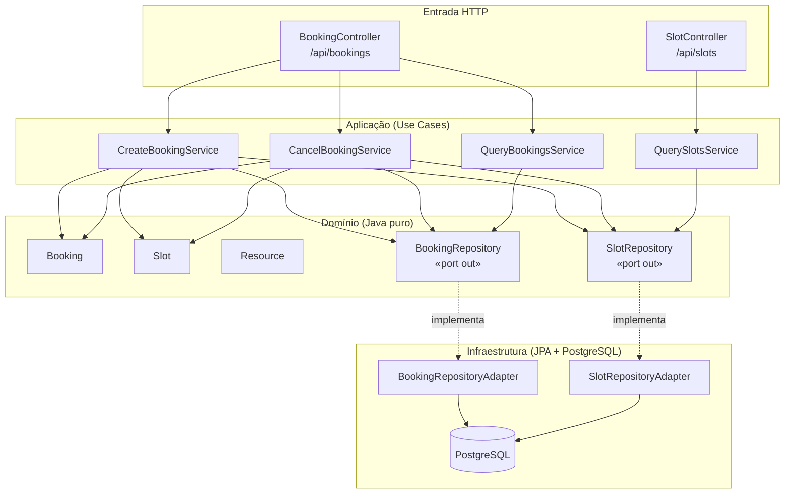
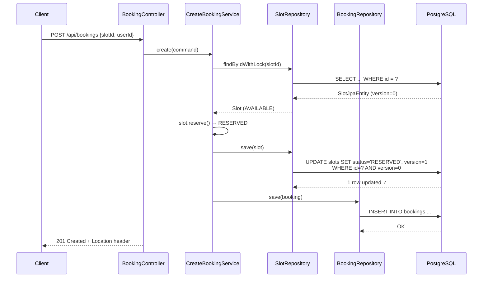
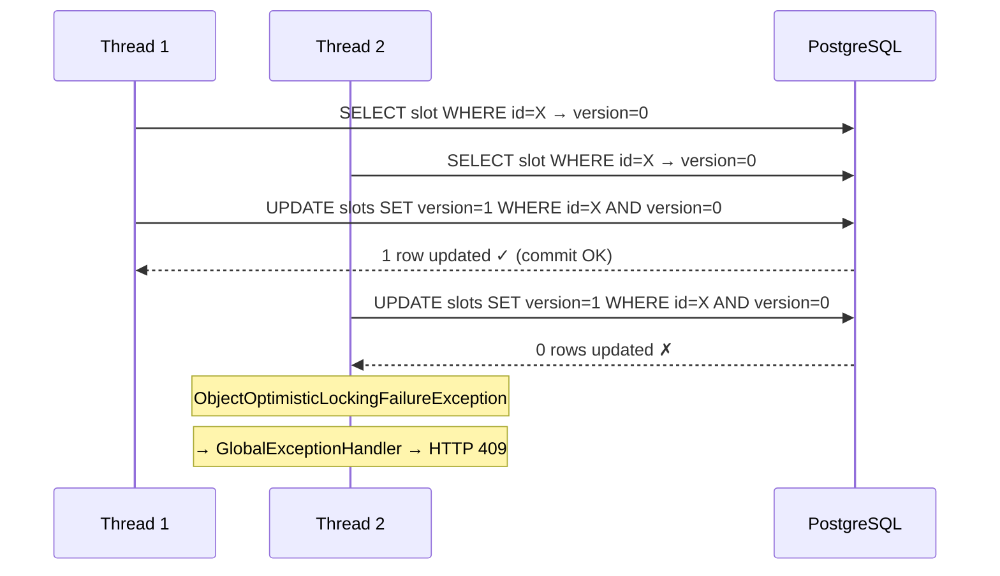

# Diagrama de Arquitetura — Booking Engine

## Camadas hexagonais

```mermaid
graph TD
    subgraph HTTP["Entrada HTTP"]
        C1[BookingController<br/>/api/bookings]
        C2[SlotController<br/>/api/slots]
    end

    subgraph APP["Aplicação (Use Cases)"]
        U1[CreateBookingService]
        U2[CancelBookingService]
        U3[QueryBookingsService]
        U4[QuerySlotsService]
    end

    subgraph DOMAIN["Domínio (Java puro)"]
        D1[Booking]
        D2[Slot]
        D3[Resource]
        P1[BookingRepository<br/>«port out»]
        P2[SlotRepository<br/>«port out»]
    end

    subgraph INFRA["Infraestrutura (JPA + PostgreSQL)"]
        A1[BookingRepositoryAdapter]
        A2[SlotRepositoryAdapter]
        DB[(PostgreSQL)]
    end

    C1 --> U1 & U2 & U3
    C2 --> U4
    U1 & U2 --> D1 & D2
    U1 & U2 & U3 --> P1
    U1 & U2 & U4 --> P2
    P1 -.implementa.-> A1
    P2 -.implementa.-> A2
    A1 & A2 --> DB
```

## Fluxo de criação de reserva (caminho feliz)

```mermaid
sequenceDiagram
    participant Client
    participant BookingController
    participant CreateBookingService
    participant SlotRepository
    participant BookingRepository
    participant PostgreSQL

    Client->>BookingController: POST /api/bookings {slotId, userId}
    BookingController->>CreateBookingService: create(command)

    CreateBookingService->>SlotRepository: findByIdWithLock(slotId)
    SlotRepository->>PostgreSQL: SELECT ... WHERE id = ?
    PostgreSQL-->>SlotRepository: SlotJpaEntity (version=0)
    SlotRepository-->>CreateBookingService: Slot (AVAILABLE)

    CreateBookingService->>CreateBookingService: slot.reserve() → RESERVED

    CreateBookingService->>SlotRepository: save(slot)
    SlotRepository->>PostgreSQL: UPDATE slots SET status='RESERVED', version=1<br/>WHERE id=? AND version=0
    PostgreSQL-->>SlotRepository: 1 row updated ✓

    CreateBookingService->>BookingRepository: save(booking)
    BookingRepository->>PostgreSQL: INSERT INTO bookings ...
    PostgreSQL-->>BookingRepository: OK

    BookingController-->>Client: 201 Created + Location header
```

## Controle de concorrência (locking otimista)

```mermaid
sequenceDiagram
    participant T1 as Thread 1
    participant T2 as Thread 2
    participant DB as PostgreSQL

    T1->>DB: SELECT slot WHERE id=X  → version=0
    T2->>DB: SELECT slot WHERE id=X  → version=0

    T1->>DB: UPDATE slots SET version=1 WHERE id=X AND version=0
    DB-->>T1: 1 row updated ✓ (commit OK)

    T2->>DB: UPDATE slots SET version=1 WHERE id=X AND version=0
    DB-->>T2: 0 rows updated ✗
    Note over T2: ObjectOptimisticLockingFailureException
    Note over T2: → GlobalExceptionHandler → HTTP 409
```
